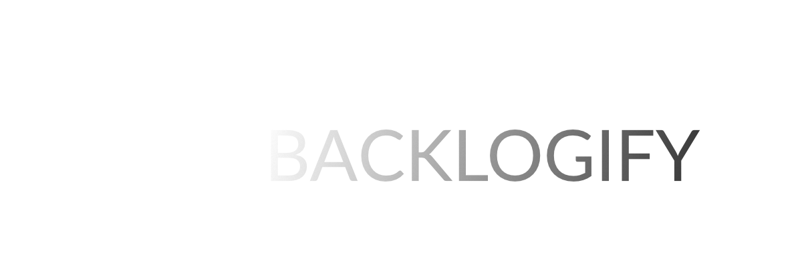
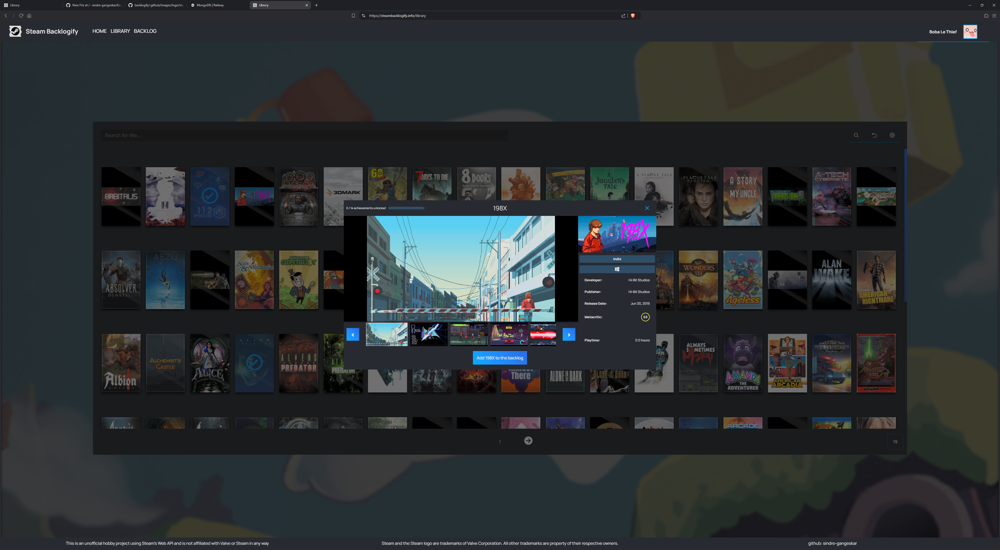

  <h3>An easy to use steam library application for adding games to your backlog</h3>

  |  
|:------------------------------------------------------------------:|:------------------------------------------------------------------:|

## Built with:
- MongoDB for storing backlogged games per steam user
- React in front-end
- Express.js as back-end server communicating with front-end and the database

### WIP - Still in development
